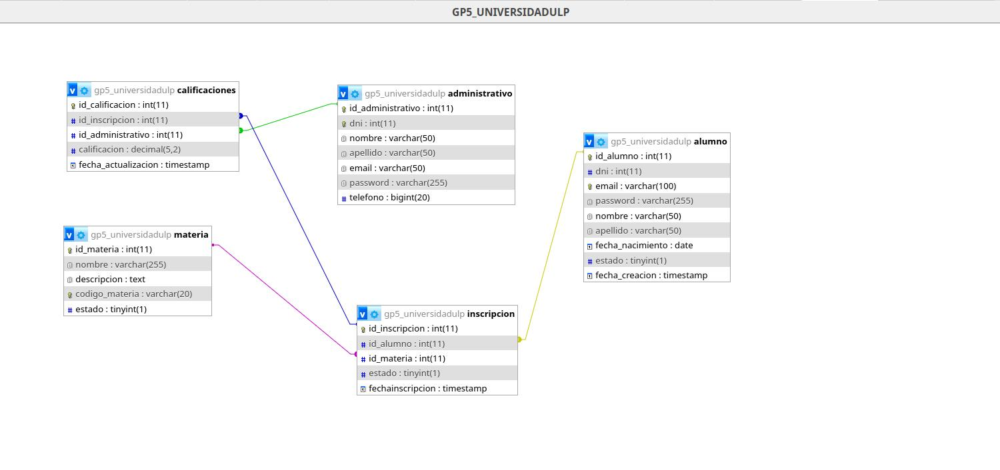

# Proyecto Transversal 🖥️

## Librerías Utilizadas 📚
- [MariaDB Java Client 3.5.6](https://github.com/emadupre/ProyectoTransversal-1/raw/main/lib/mariadb-java-client-3.5.6.jar)
- [JCalendar 1.4](https://github.com/emadupre/ProyectoTransversal-1/raw/main/lib/jcalendar-1.4.jar)

## Script SQL 🧱
- [Script de Base de Datos](https://github.com/emadupre/ProyectoTransversal-1/raw/main/script/gp5_universidadulp.sql)

## Descripción 🗒️
Este es el Proyecto Transversal para el Sistema de Gestión de la Universidad de La Punta. El objetivo de este proyecto es desarrollar una solución integral que facilite la administración y gestión de diversas funciones dentro de la universidad.

## Integrantes del Equipo 🫂
- Enzo Fet
- Naiara Bongiovani
- José Bossa
- Claudia Bonisoni
- Gonzalo Achucarro
- Jesús Emanuel García

## Funcionalidades ⚙️
- [Permitir al personal administrativo listar las materias que cursa un alumno.]
- [Permitir al personal administrativo listar los alumnos inscriptos en una determinada materia.]
- [Permitir que un alumno se pueda inscribir o desinscribir en las materias que desee.]
- [Permitir registrar la calificación final de una materia que está cursando un alumno.]
- [Permitir el alta, baja y modificación de los alumnos y las materias.]



## Para clonar: 📦
Clona el repositorio:
   ```bash
   git clone https://github.com/emadupre/ProyectoTransversal-1.git
